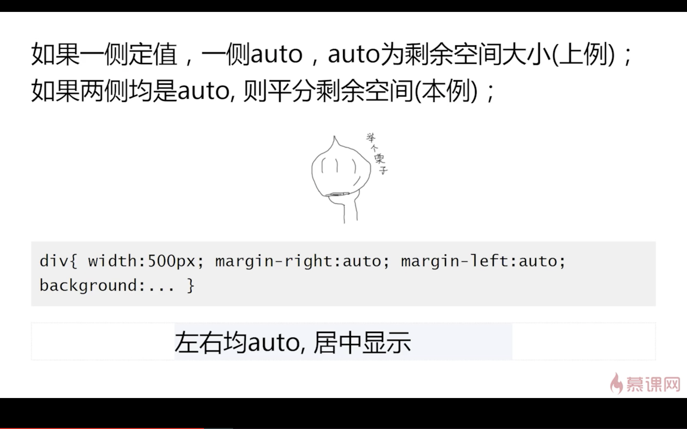
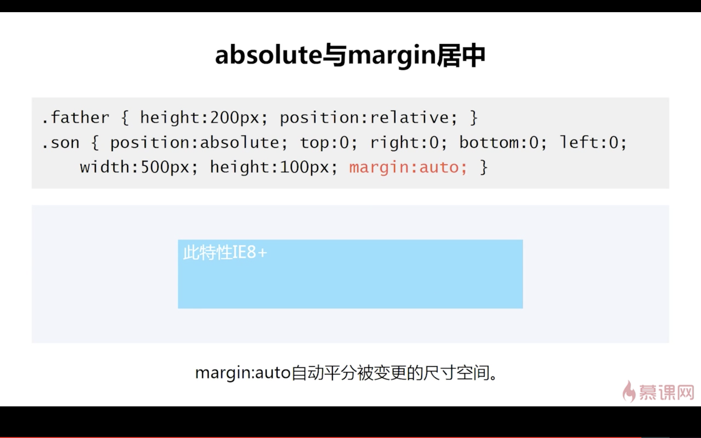
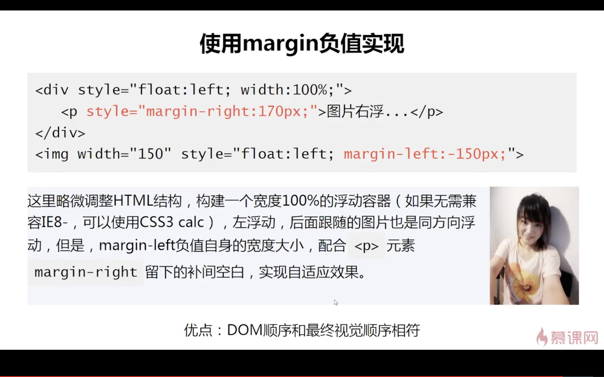

## css的相关知识点

### css的选择器
文档地址[http://www.ruanyifeng.com/blog/2009/03/css_selectors.html]


### css的collapse属性
+ visibility有hidden，collapse，inherit，visible四个属性
+ 在设置表单元素时，有如下的功能
	- collapse在**非**chrome浏览器中，与display：none有相同的效果，隐藏，不会占用位置
	- collapse在chrome浏览器中，以visibility:hidden 有相同的效果，隐藏内容，还占用位置

### css 绘制三角形
+ 一个盒子的边框的一层一层向外画，边框约粗看的越明显
```css
	.box {
		width:0;
		heihgt:0;
		border-left: 50px solid transparent;
		border-right: 50px solid transparent;
		border-bottom: 50px solid #f00;
	}
```

1. 什么是css的盒模型，IE低版本的盒子模型又何不同
+ 盒模型有两种，ie盒子模型和w3c盒子模型
+ 盒模型：content padding margin border
+ ie：border-box，w3c：content-box


2. css的选择器有哪些，css有哪些属性可以继承？
+ css的选择器
	- id选择器 （#id）
	- 类选择器 （.class）
	- 标签选择器 （input）
	- 后代选择器 （ul li）
	- 属性选择器 （input[type=‘btn’])
	- 伪类选择器 （a：hover）
+ css不可继承的属性：padding margin border height width 
+ css 可以继承的属性： font-size color 

3. css的优先级算法如何计算？
+ 就近原则，后面的会覆盖前面的
+ 行内样式 > 嵌入样式 > 外部引用的样式
+ !imporant  > id > class > 标签

4. css有哪些伪类和伪元素
+ 伪类：LVHA，hover,
+ before after ::selection first-letter first-line

5. 如何居中一个div
```css
	<style>
	.box {
		 display: flex;
		 justify-content:center;
		 align-items:center;
	}
	</style>
```

6.display 有哪些值。并说明她们的作用
+ none 隐藏元素
+ block 让元素块级显示，独占一行
+ inlin-block 默认宽度为内容宽度，可设置宽高
+ inline 默认宽度为内容宽度，不可设置宽高
+ table 和table一起使用
+ inherit 继承父元素的display的属性

7. position的属性
+ relative 相对于自身的定位
+ absolute 想对于第一个值不为static的定位的父元素
+ fixed 根据浏览器的窗口进行定位
+ static 没有定位
+ inherit 继承父元素的定位

8. css3有哪些新的属性
+ 圆角 border-radius
+ 阴影 shadow
+ 文字特效 text-shadow
+ 旋转 transform 
+ 运动 transition

9. css3中的flexbox，弹性盒模型
+ 任何元素通过设置display:flex都可以变成弹性盒模型，变成一个伸缩模型
+ 在盒模型内，所有的子元素，都成为和模型的条目，flex-items

10. css的多列等高如何实现？
文档地址[https://codepen.io/yangbo5207/post/equh]
+ padding-bottom 和margin-bottom

11. 经常遇到的浏览器兼容性问题有哪些？原因，怎么处理的？常用的hack技巧
+ png24的图片，在ie6上会出现背景，解决方案是使用png8来代替
+ 不同的浏览器，默认的padding和margin是不同的，解决方案是在css文件中清楚padding和margin的默认样式
+ ie6的双边距问题
> 块属性设置了float之后，又设置了magin，ie6上显示的margin是双倍的宽度,解决办法是设置*display：inline
+ chrome中，默认字体最小是12px，小于12按照12px显示，可通过设置css的属性：-webkit-text-size-adjust:none;来解决

12. li和li之间，看不见的空白间隙是什么原因引起的？有什么解决办法?
+ display:inline-block ,是由于空格，空过也算字符
+ 解决办法
	- font-size：0
	- word-space：-个数 * 2
13. 什么是BFC，
+ BFC block formatting context
+ BFC内部的元素和外部的元素不会相互影响


### margin 
1. margin 的百分比计算
	+ 普通元素师相对于父级的**宽度**进行计算的，(无论是margin-top还是margin-left)
	+ 带有定位的元素，margin的百分比是相对于第一个不为static的定位的父级元素
	+ 应用
	> 2:1的盒子布局，margin：50%；

2. margin的重叠
	+ 只发生在block水平重叠（不包括float和absolute
	+ 只发生在垂直方向（不考虑wwriting-mode，垂直书写的文字）margin-top／margin-bottom
	+ 发生重叠的场景：
		- 相邻的兄弟元素
		- 父级和第一个／最后一个子元素
			* 父子元素重叠的其他条件
			1. 父元素非格式化上下文元素
			2. 父元素没有border-top／border-bottom的值
			3. 父元素没有padding-top／paddin-bottom的值
			4. 父元素和第一个子元素之间没有inline元素分隔
			5. 父元素没有设置height／min-height／max-height的限制（margin-bottom）
		- 空的block元素（自己和自己发生重叠）
		> 元素没有border／padding／没有内连元素／没有设置高度（height／min-height）
	+ 如何解决父子级的margin重叠
		1. overflow：height
		2. border-top 设置
		3. padding-top 设置
		4. 加一个内连元素
		5. 设置高度


	+ 重叠计算的方法
		- 正正取大值
		- 正负值相加
		- 负负最负值（-30和-20 取-30，取绝对值大的）

3. margin重叠的意义--为了让网页排版，便于用户的阅读
	+ 不同标签之间的默认宽度不同，排版不自然
	+ 在web中任何地方嵌套活着直接放入任何裸的div，都不会影响原来的布局
	+ 遗落的空的任意多个p元素，不要影戏那个原来的阅读排版


### margin-auto--分配块级元素的剩余空间








### margin 负值的应用
1. margin的两端对齐


2. margin的等高布局--margin可以改变元素的占据空间

3. 两栏自适应布局





# float 浮动
## float的设计初衷：文字环绕效果

## 清楚浮动的方法
```css
	<!-- clearfix 只用在饱含子元素的父级元素上 -->
	.clearfix:after {
		content: '';
		display: table;
		clear: both;
	}
	.clearfix {
		*zoom:1;
	}
```

## float可以让元素block化，去空格化

## ie7浮动的问题
1. 含clear的浮动元素包裹不正确
2. 浮动元素倒数两个莫名垂直间距的问题
3. 浮动元素最后一个字符重复
4. 浮动元素楼梯排列的问题
5. 浮动元素和文本不在同一行的问题

## BFC
> overflow：auto／scroll／hidden ，只有不为visible
1. 清楚浮动的影响，对ie6不管用，但是要添加_zoom:1;
2. 避免margin穿透的问题
3. 两栏自适应布局


