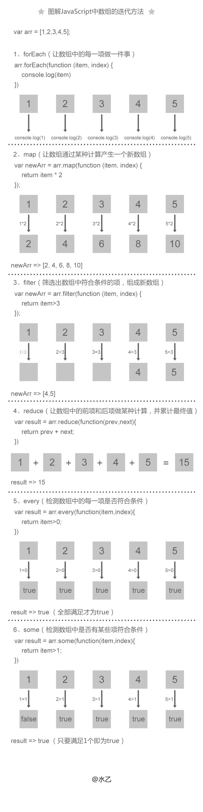

## js中的for循环

### for 
> 循环
```js
	var arr = ['qaz','wsx','edc','rfv'];
	for (var i=0,len=arr.length;i<len;i++) {
		console.log(i)
		console.log(arr[i])
		console.log(typeof i,typeof arr[i]) // number string
	}
```
### for in
> 用来循环数组或者对象的属性,循环中得到的i是字符串，而不是数字

```js
	var arr = ['qaz','wsx','edc','rfv'];
	for (var i in arr) {
		console.log(i)
		console.log(arr[i])
		console.log(typeof i,typeof arr[i]) // string string
	}

	// for in不仅可以遍历数组，还可以遍历对象,因为for in遍历的是对象的属性，而不是对象的索引
	const person= {
		fname: 'zhang',
		lname: 'san',
		age: 18
	}
	let i;
	for (i in person) {
		console.log(person[i]);
	}
	
	// 遍历对象中所有的属性
	const arr = [1,2,3];
	arr.name = 'tom';
	let i;
	for (i in arr) {
		console.log(arr[i]) // 1,2,3,tom
	}
	
	// for in 同样便利原型链上的的属性
	arr.prototype.fatherName = 'tomf';
	arr.name = 'tom';
	let i;
	for (i in arr) {
		console.log(arr[i]) // 1,2,3,tom
	}
```


### for of
> 只返回具有数字索引的属性
```js
	var arr = ['qaz','wsx','edc','rfv'];
	arr.name = 'tom';
	for (var i of arr) {
		console.log(i) // 直接获取属性值
		console.log(typeof i) // string
	}

```

### forEach
> 高阶函数，会有一个callback函数
```js
	const array = [1,2,3];
	array.forEach(function(data){
		console.log(data)
	})

	// 遍历对象的用法
	const array1 = [];
	array1[0] = 'a';
	array1[1] = 'b';
	array1[10] = 'c';
	array1.name = 'tom';
	array1.forEach((data,index,array) => {
		console.log(data,index,array);
	})
```


## 各种循环的优缺点
+ 优点
	- for 可以使用break continue return
	- forEach 是高级函数，可以遍历数组，对象，
	- for in， 可以遍历遍历数组，对象，可以遍历原型链上的属性
	- for of ， 可以遍历遍历数组，对象，可以使用break continue return
+ 缺点
	- for 不可以遍历对象的，只可以遍历数组
	- forEach 是不能使用break continue return
	- for in， 没有break continue return
	- for of 不支持普通对象，返回只有数字索引的属性


### forEach 和map的区别


