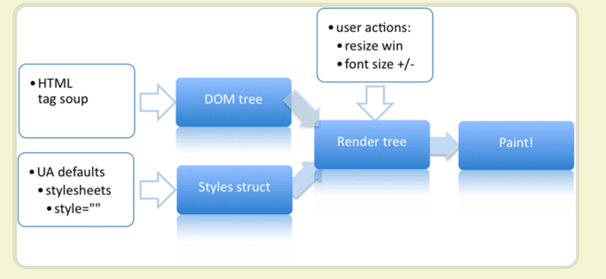
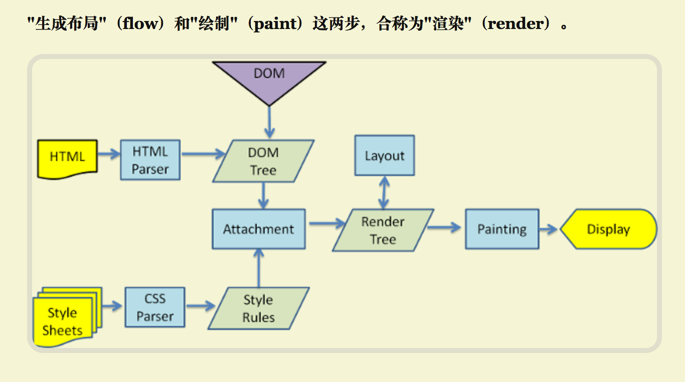

## 重绘和重排
文档链接[http://www.ruanyifeng.com/blog/2015/09/web-page-performance-in-depth.html]
js和css性能优化几点[https://segmentfault.com/a/1190000008829958]
高性能的重绘与重拍[http://www.cnblogs.com/zichi/p/4720000.html]
高性能的js DOM编程[http://www.cnblogs.com/zichi/p/4713031.html]


### 页面生成的过程（5）
1. html代码装换成DOM
2. css代码转化成CSSOM
3. DOM + CSSDOM，生成一了渲染树（包含了每个节点的视觉信息）
4. 生成布局（layout），就是将所有的节点进行平面合成
5. 将布局绘制（paint）在屏幕上

> 上述步骤，1～3很快，4，5是耗费时间



### 重绘和重排的概念
1. 重绘：重新绘制，当盒子的位置，大小以及其他的属性，如颜色，字体大小都确定下来之后，浏览器于是便把这些元素都按照各自的特性绘制了一遍，于是页面的内容出现了，这个过程称之为repaint
2. 重排：重新布局，对于dom结构中的各个元素都有自己的盒子模型，这些都需要浏览器根据各种样式来计算，并根据计算结果将元素放在它该出现的位置，这个称之为reflow

### 如何触发重绘和重排
1. 修改DOM结构， dom元素的添加，修改（内容），删除（reflow+repaint）
2. 修改样式表，修改dom的元素的字体颜色（只有repaint，因为不需要调整布局）
3. 用户事件：鼠标滚动，页面滚动，输入框文字大小改变，改变窗口的大小，
3. **重排一定触发重绘，但是重绘不一定触发重排**


### 重回和重排对性能的影响
> 重绘和重排的不断的触发， 是不可避免的，这个过程非常的消耗资源，直接影响了网页的性能

## 提高网页的性能，就是要减少重绘和重排的频率和成本，尽量少触发重新渲染

1. DOM和CSS的变动，都会触发重新渲染，但是浏览器会尽量将所有的变动集中在一起，排成一个队列，然后一次执行，避免重新渲染（进行队列化，进行批量的渲染）

```js
	<script>
		// div虽然有两个变动，但是只触发了一次的渲染
		div.style.color = '#f00';
		div.style.marginTop = '30px';

		// 下面的代码，触发了两次渲染
		div.style.color = '#f00'; // 设置背景色
		var margin = parseInt(div.style.margin); // 获取margin的位置，浏览器重排
		div.style.marginTop = margin + 10 + 'px'; // 再次渲染
	</script>
``` 

2. 某些情况下，或强制的触发队列更新，（获取布局的重新操作，会触发更新）
+ offsetTop/offsetLeft/offsetWidth/offsetHeight
+ scrollTop/scrollLeft/scrollWidth/scrollHeight
+ clientTop/clientLeft/clientWidth/clientHeight
+ getComputedStyle
> 尽量不要把读操作和写操作放在一个语句中

```js
	<script>
		// bad
		div.style.left = div.offsetLeft + 10 + 'px';
		div.style.top = div.offsetTop + 10 + 'px';

		// good 
		var left = div.offsetLeft;
		var top = div.offsetTop;

		div.style.left = left+ 10 + 'px';
		div.style.top = top + 10 + 'px';
	</script>
```

3. 总结
+ 样式表约简单，重排和重绘也就约快
+ dom的层级越高，重排的成本越高
+ table的重排和重绘的成本要高于div

## 提高性能的几个小技巧
1. 读操作和写操作，要分开，避免多次重排和重绘，将读放在一起，将写放在一起

```js
	<script>
		// bad
		div.style.left = div.offsetLeft + 10 + 'px';
		div.style.top = div.offsetTop + 10 + 'px';

		// good 
		var left = div.offsetLeft;
		var top = div.offsetTop;

		div.style.left = left+ 10 + 'px';
		div.style.top = top + 10 + 'px';
	</script>
```
2. 如果某个样式是通过重排得到的，那么最好缓存结果，避免下次用到的时候，又要重新获取
```js
	<script>
		// good 
		var left = div.offsetLeft; // 缓存重排的样式结果
		var top = div.offsetTop; // 缓存重排的样式结果

		div.style.left = left+ 10 + 'px';
		div.style.top = top + 10 + 'px';
	</script>
```
3. 在改变多个样式的时候，不要一条条的改变，通过cssText或者class来改变，提高性能

```js
	<script>


		// good 
		var left = div.offsetLeft;
		var top = div.offsetTop;

		// bad
		div.style.left = left+ 10 + 'px';
		div.style.top = top + 10 + 'px';

		// good
		div.style.cssText += '; left: ' + left + 10 + 'px; top: ' + top + 10 + 'px';  //  一次改变
	</script>
```

4. 尽量使用离线DOM，而不是真实的网页dom，来改变样式（类似于react的dom diff）
	+ document fragment 把这个对象插入到DOM中
	+ cloneNode 在节点上进行操作，然后再将clone的节点替换原始的节点

```html
	<ul id='fruit'>
	  <li> apple </li>
	  <li> orange </li>
	</ul>
	<script>
		// 对上述新新添加两项

		// 一般会直接想到如下的代码
		var lis = document.getElementById('fruit');
		var li = document.createElement('li');
		li.innerHTML = 'apple';
		lis.appendChild(li);

		var li = document.createElement('li');
		li.innerHTML = 'watermelon';
		lis.appendChild(li);

		// 上述代码重排了两次，如何解决，display：none。不占dom中的位置，但是会有闪烁
		// 这是就要用到fragment来操作

		var fragment = document.createDocumentFragement();

		var li = document.createElement('li');
		fragment.innerHTML = 'apple';
		fragment.appendChild(li);

		var li = document.createElement('li');
		fragment.innerHTML = 'watermelon';
		fragment.appendChild(li);

		document.getElementById('fruit').appendChild(fragment);

		// 文档片段是轻量级的，就是为了更新和移动节点
		
		// 1: 0.598876953125ms
		// 2: 0.35107421875ms
	</script>
```

5. 现将元素设置成display：none（一次的重绘和重排），然后对这个元素进行100次操作，然后在恢复显示（一次的重绘和重排）
	+ 两次的重绘和重排，代替了复杂的100次操作

6. position为fixed和absolute，不占用文档流的位置，对重绘和重排的影响小，不用考虑对其他元素的影响

7. visibility：hidden只对重绘有影响，对重排没有影响

8. 使用虚拟的react脚本库，他有domdiff
9. 使用window.requestAnimationFrame()和window.requestIdleCallback这两个方法
+ window.requestAnimationFrame是将某些代码放到下一次重新渲染的时候执行

```js
	<script>
	// 循环操作，将每一个元素的高度增加一倍，但每次循环的时候，都是一个读操作后面跟着一个写操作，这会在短时间内触发了大量的重绘和重排，对网页性能不利
	function doubleHeight(element){
		var currentHeight = element.clientHeight;
		element.style.height = currentHeight * 2 + 'px';
	}
	elements.forEach(doubleHeight)

	// 使用window.requestAnimationFrame，将读写分离，把所有的写操作放倒下一次渲染
	function doubleHeight(element){
		var currentHeight = element.clientHeight;
		window.requestAnimationFrame(function（）{
			element.style.height = currentHeight * 2 + 'px';
		})
		
	}
	elements.forEach(doubleHeight)

	// 页面滚动的监听函数
	window.onscroll = function(){
		window.requestAnimationFrame('执行滚动的操作')
	}	
	</script>
```

## 刷新率
1. 网页动画的每一帧都是重新渲染，当每秒30-60的时候，才不会觉得卡顿，比较流畅
;
2. 大多数显示器是60Hz， 为了与系统一致， 一般也会选择60hz的频率刷新动画
;
3. 一秒60hz，那么就是每一帧是1／60，就是16.66ms

> 一秒之内能完成多少次刷新，就叫做刷新率


### 重绘和重排的性能对比
```js
	<script>
		// 
		var times = 15000;
		console.time(1);
		for (var i = 0; i < times; i++) {
			document.getElementById('myDiv1').innerHTML += 'a';
		}
		console.timeEnd(1);
		console.time(2);
		var str = '';
		for (var i = 0; i < times; i++) {
			var tmp = document.getElementById('myDiv2').innerHTML;
			str += 'a';
		}
		document.getElementById('myDiv2').innerHTML = str;
		console.timeEnd(2);

		console.time(3);
		var _str = '';
		for (var i = 0; i < times; i++) {
			_str += 'a';
		}
		document.getElementById('myDiv3').innerHTML = _str;
		console.timeEnd(3);

		//1: 1256.2626953125ms

		// 2: 9.1181640625ms

		// 3: 1.622802734375ms
	</script>
```


